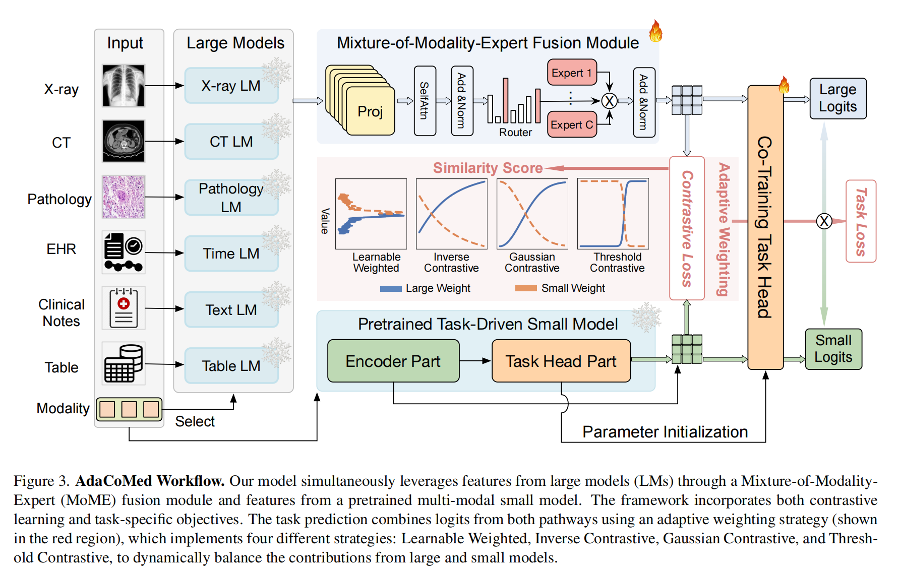

# [CVPR2025] - Multi-modal Medical Diagnosis via Large-small Model Collaboration

## Introduction
This is the code for the paper "Multi-modal Medical Diagnosis via Large-small Model Collaboration" accepted by CVPR2025. The code is implemented on dataset RAD-VQA.

## Requirements
- python 3.10.14
- pytorch 2.2.1+cu121
- torchvision 0.17.1+cu121
- transformers 4.40.2
- llm2vec 0.2.2
- peft 0.13.0

运行以下命令安装所需的依赖包：

```python
pip install -r requirements.txt
```

## Data Preparation
把数据集放在`data`文件夹下

## Large Model Preparation
把dinov2模型及代码放在`LM/Image`文件夹下
把llm2vec模型及代码放在`LM/llm2vec-0.2.2`文件夹下
利用llm2vec仓库将decoder-only模型转换为text-encoder模型，将这个output model作为text large model

## Small Model Preparation
因为本代码基于VQA-RAD数据集，所以选取的小模型是MICCAI19-MedVQA-master，并将该模型权重也放置在`VQA/MICCAI19-MedVQA-master/saved_models`文件夹下

## Training
首先准备大模型小模型提取的特征，运行以下命令：
```python
python process_large_embed.py
```
然后基于提取的特征训练模型，运行以下命令：
```python
python train.py
```
